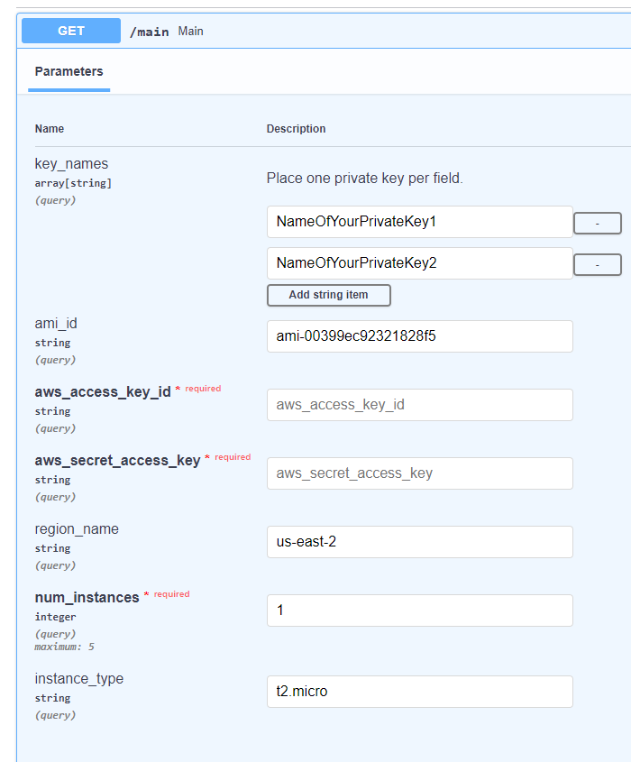

# python-aws-mockup
A dockerised Fastapi, pydantic and boto3 automated and quick solution to launch ec2 instances.


## Main Features

- Simple and easy to follow/customise/build upon 😎
- Intuitive interface/integration using [FastAPI](https://fastapi.tiangolo.com/) 💪
- Quick automation solution 👽

## Usage

Use docker-compose in the root directory to spin-up the docker.

<div class="termy">

```console
$ docker-compose up

```

</div>

When server starts running:

<div class="termy">

```console
INFO:     Uvicorn running on http://0.0.0.0:8000 (Press CTRL+C to quit)
INFO:     Started reloader process [1] using statreload
INFO:     Started server process [8]
INFO:     Waiting for application startup.
INFO:     Application startup complete.
```

Navigate to [http://localhost:8000](http://localhost:8000) and check out your endpoint:



## Notes

- You already need to have set up a user with appropriate programatic access to be able to programatically create ec2 instances and have your access key and secret key credentials.

- Note that currently you can add multiple private keys. For each key one enters, whatever number of instances specified in ```num_instances``` field, will be created. For example, if you add two keys and ```num_instances``` is 2, then for each key, two instances will be created (total of 4 instances). Each pair corresponding to one of the two keys.

## Disclaimer

The code in this repo is provided “as is," and you use it at your own risk. I make no warranties as to performance, merchantability, fitness for a particular purpose, or any
other warranties whether expressed or implied.
No oral or written communication from or information provided by me shall create a warranty.
Under no circumstances shall I be liable for direct, indirect, special,
incidental, or consequential damages resulting from the use, misuse, or inability to use this repo even if advised of the possibility of such damages.

So please DO NOT rack up huge costs and complain later!